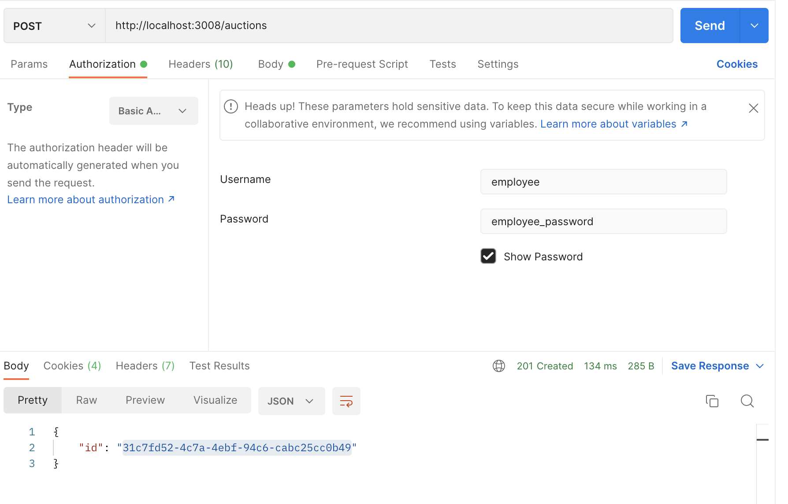
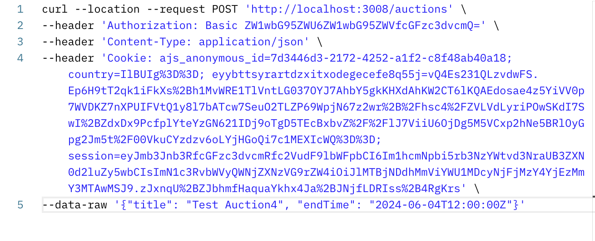
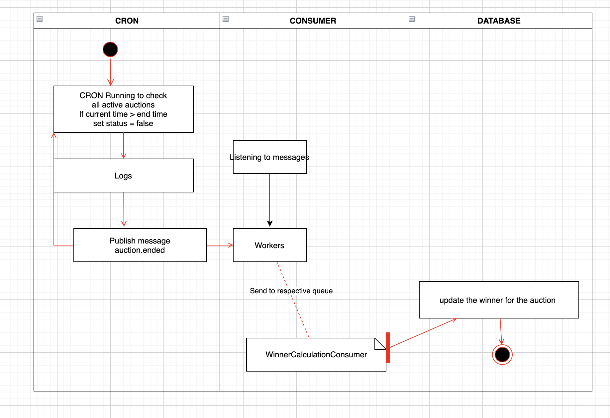

# Auction API

This is a simple Auction API built using Express.js and TypeScript. It provides endpoints for creating auctions, placing bids, and retrieving auction details.
The winner of an auction is defined by the highest bid placed before the ending time. In the event of
a tie, the first user to place that bid is the winner.

## Requirement

1. Only Employee can create auctions.
2. Bidders can view and bd on auctions.

## Users
We have 4 users in the system currently
1. employee
2. bidder1
3. bidder2
4. bidder3

For all the password is `employee_password`

## API Specification

The API follows the OpenAPI 3.0.0 specification. Here are the available endpoints:

- POST /auctions: Create a new auction
- POST /auctions/{id}/bid: Place a bid on an auction
- GET /auctions/{id}: Get details of an auction by ID
- GET /auctions/{id}/winner/calculation: Find the winner of the auction

For detailed API documentation, refer to the OpenAPI specification provided.

## Setup Instructions

1. **Install dependencies:**
- `npm install`
2. **Set environment variables:**
- Create a `.env` file in the root directory if not provided
- Define the following environment variables:
  - PORT: Port number for the server (optional, default is 3000)
  - PASSWORD: Hash Password for the user ( For now BOTH user and employee passwrod are same for simplicity)

4. **Start the server:**
- `npm run dev` It will start development server with nodemon enabled
- `npm run build` It will build the project for production


## Folder Structure

The folder structure of the Auction API is organized to promote maintainability, scalability, and separation of concerns. It follows a modular architecture that divides the codebase into distinct folders based on their functionalities.

Overview
- controllers: Contains the logic for handling HTTP requests, processing data, and generating responses. Each controller corresponds to a specific route or set of routes.
- services: contains the logic of creating auctions and returning , calculating winner and placcing bids.
- middlewares: Houses custom middleware functions that intercept incoming requests, perform additional processing, and modify the request or response objects before passing them to the route handlers.
- models: Defines the data models or schemas used in the application. Models represent the structure of data entities and may include validation logic, data manipulation methods, and database interactions.
- routes: Contains route definitions and route-specific middleware. Each route file defines the endpoints and their associated route handlers.
index.ts: The main entry point of the application where the Express server is initialized, middleware are applied, and routes are mounted.
```
auction-api/
│
├── controllers/
│   ├── auctionController.ts
│   └── ...
│
├── middlewares/
│   ├── baiscAuthMiddleware.ts
│   └── ...
│
├── models/
│   ├── Auction/
|   ├──── type.ts
|   ├──── auction.ts
│   └── ...
│
├── routes/
│   ├── auction.ts
│   └── ...
│
└── index.ts
```
## Usage Guide

### Creating an Auction

To create a new auction, send a POST request to `/auctions` with the following JSON body payload:
```json
{
"title": "Example Auction",
"endTime": "2024-07-13T12:00:00Z"
}
```
You need to authenticate using basic authentication.

If you are using postman you can go to Authorization tab and select Basic Auth Type , enter your username and password as shown in the image below.


if you are using curl you need to send header with Authorization. Example shown below.

- Important: The Authorization header contains the word "Basic" followed by a base64-encoded string of "username:password".

### Placing a Bid
To place a bid on an auction, send a POST request to `/auctions/{id}/bid` with the auction ID in the path parameter and the bid value in the request body:

```json

{
  "value": 50.50
}
```
You need to authenticate using basic authentication.

### Getting Auction Details
To get details of an auction by ID, send a GET request to `/auctions/{id}` with the auction ID in the path parameter. You'll receive a JSON response with the auction details.
```json
{
    "id": "31c7fd52-4c7a-4ebf-94c6-cabc25cc0b49",
    "title": "Test Auction4",
    "endTime": "2024-06-04T12:00:00Z",
    "winnerUsername": "bidder2"
}
```

## Middleware

Middleware plays a crucial role in enhancing security and controlling access to resources in web applications. We have used two main middlewares in this project

- `BasicAuthMiddleware`: 
The Auction API utilizes basic authentication middleware to secure its endpoints. This middleware ensures that only authorized users can access the API by verifying their credentials before processing any requests. Basic authentication involves sending a username and password with each request, encoded in base64 format.


- `CheckPermissionMiddleware`: The checkPermission middleware examines the permissions associated with the authenticated user and determines whether they have the required permissions to access a particular endpoint. If the user possesses the necessary permissions, the middleware allows the request to proceed to the route handler. Otherwise, it returns a 403 Forbidden response, indicating that the user is not authorized to access the resource.

Few use cases that are covered in this API
- Employee can only create auction 
- user can view auction and bid on auction
- Employee cant bid on auction


## Architecture

### Auction Winner Calculation Architecture
This repository contains the architecture for calculating winners using simple REST API but in real world i suggest using an asynchronous approach with RabbitMQ.

### Overview
The system allows for the calculation of winners for auctions in a scalable, fault-tolerant, and asynchronous manner. It decouples the winner calculation process from the REST API, allowing for real-time updates and better scalability.

### Architecture Components
The architecture consists of the following components:

### Producer (CRON):
- The CRON will be used to periodically checks the current time against the end time of auctions.

### RabbitMQ:
- RabbitMQ acts as the message broker facilitating communication between the producer (REST API) and consumers (workers).
- It consists of exchanges where messages are published and queues where messages are stored until consumed.
### Consumers (Workers):
- Consumers are worker processes responsible for performing the actual winner calculation.
- They subscribe to RabbitMQ queues where winner calculation messages are published.
- When a message is received, a consumer processes it by calculating the winner for the specified auction based on the auction's id.

### Database:
- A database ( nosql) is used to store auction data, including bids, auction status, and winner information.
- Implement a scheduled task or cron job that periodically checks the current time against the end time of auctions.
### Workflow
- When an auction is created, store its end time and status is active along with other auction details in the database.
- Implement a scheduled task or cron job that periodically checks the current time against the end time of auctions.
- When an auction is marked as ended, publish a message to a RabbitMQ exchange indicating the need for winner calculation for that auction.
- The message should include the auction ID or any other necessary information for identifying the auction.
- Consumers (worker processes) subscribe to the RabbitMQ queue associated with winner calculation messages.
- When a message for winner calculation is received, a consumer processes it by calculating the winner for the specified auction based on the auction's bids and criteria.
- After calculating the winner, update the database with the winner information and adjust the auction status accordingly. Below is the graphical representation of the workflow


## Testing

We have use Unit test to test the sorting logic for winner calculation with highest bid and if its tie than the earlir one will be the winner.

To run test
```
npm test
```